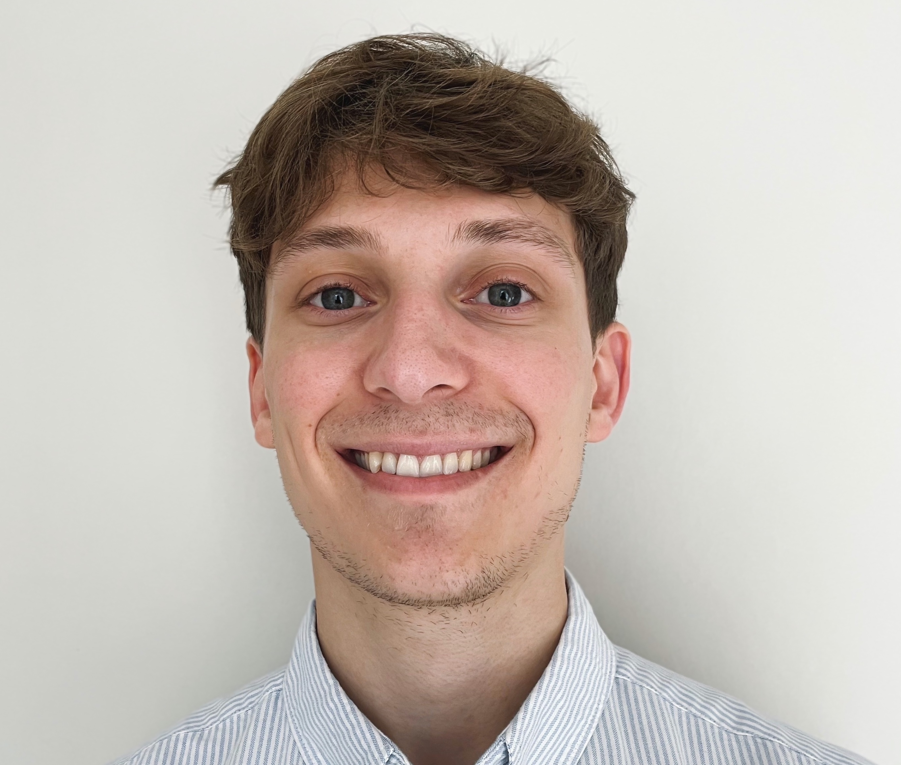

# About Me

{ width=60%,caption="Me" }

Hi I'm Dom!

I completed my Master's degree in Astrophysics at the University of Liverpool in 2021.  In my third year, I began working with Dr Ricardo Schiavon on an observational [project](TERZAN5.md) at LJMU's Astrophysics Research Institute from which I have been able to write a first-author paper on the topic of Milky Way stellar populations.  The paper, titled "Is Terzan 5 the remnant of a building block of the Galactic bulge? Evidence from APOGEE" has now been [published](https://arxiv.org/abs/2204.01753) on the arXiv preprint and in the Monthly Notices!

In my fourth year, I carried out my Master's [project](EAGLE.md) supervised by Prof. Rob Crain on "What Influences the Efficiency of Galaxy Formation?" using the EAGLE cosmological simulations.

Currently, I am carrying out a research [project](AGN.md) at the Leibniz-Institut für Astrophysik Potsdam (AIP) with Dr Mirko Krumpe.  There, I am searching for changing-look AGN (CLAGN) to investigate their causes, involved time-scales, and the frequency at which the changes happen.

In October 2022, I will be starting my PhD at Durham University where I will be supervised by Prof. Mark Swinbank.  Throughout my project, I will be investigating galaxy evolution over the last 10 billion years by studying gas dynamics and star formation in large samples of galaxies using some of the world's best telescopes!
