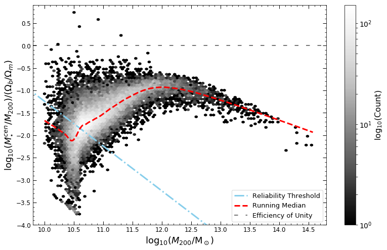

# EAGLE

## Efficiency of Galaxy Formation

In the cosmological context, galaxies grow via hierarchical merging from the accretion of lower mass systems.  The stellar mass - halo mass relation (SMHM) tells us that more massive haloes of dark matter host more massive galaxies, but this relation exhibits significant scatter i.e. other physical processes must be causing some galaxies to be less massive at some fixed value of halo mass.

Here is the SMHM relation from the 100 cMpc side EAGLE simulation.  Along the x-axis is the total halo mass (M200) and along the y-axis is the fraction of stellar mass out of the total halo mass (Mstar/M200).  So we can see that at low and high halo mass, galaxies are not so efficient in forming stars, whereas between there is a sweet spot where galaxies most efficiently form.

## Dependence on Feedback

Prior investigations had showed that stellar and AGN feedback directly influence formation efficiency.  Their effects can be seen in the plot below of the 50 cMpc side EAGLE simulation with variations in strength of feedback.

Top-left is the unaltered reference model with AGN feedback temperature of 8500K, top-right is with decreased AGN temperature to 8000K, middle-left is increased to 9000K, middle-right is with no AGN feedback, and bottom-left is with no stellar feedback.  We can see that stellar feedback reduces formation efficiency at low halo mass and AGN feedback reduces it at high halo mass.

## Main Conclusions from the Investigation

Using the Evolution and Assembly of GaLaxies and their Environments (EAGLE) hydrodynamical cosmological simulations, I investigated the second order influences on the efficiency of galaxy formation by exploring what physical processes correlate with stellar mass at fixed halo mass.

Processes such as the birth density, metallicity, stellar age, gas density, energy fraction and gas fraction were studied to explore their correlations with formation efficiency at fixed halo mass because they trace changes in morphology and determine the mechanisms by which galaxies evolve.

The following plots include the statistical Spearman Rank correlation coefficient where a positive (negative) value indicates a positive (negative) correlation between Mstar/M200 and the third variable that the relation is coloured by.

### Birth Density

* Feedback from stars and AGN influences the ability of galaxies in exploiting high gas density to form stars.

### Stellar Age

* Low and high-mass early-assembling haloes host more efficiently formed galaxies whereas, between regimes, late-assemblers do.

### Energy Fraction

* In the EAGLE simulations, the scaling relation between regimes is sensitive to the energy-fraction function and, at high halo mass, is sensitive to the modelling of AGN feedback as it is essential in reproducing observed morphological transformations.

[back](./)
