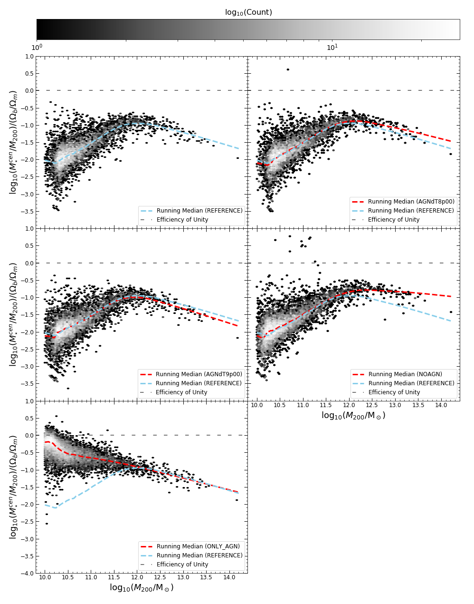
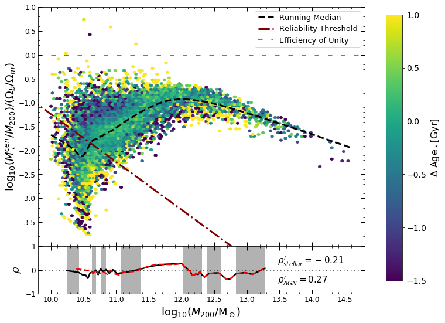
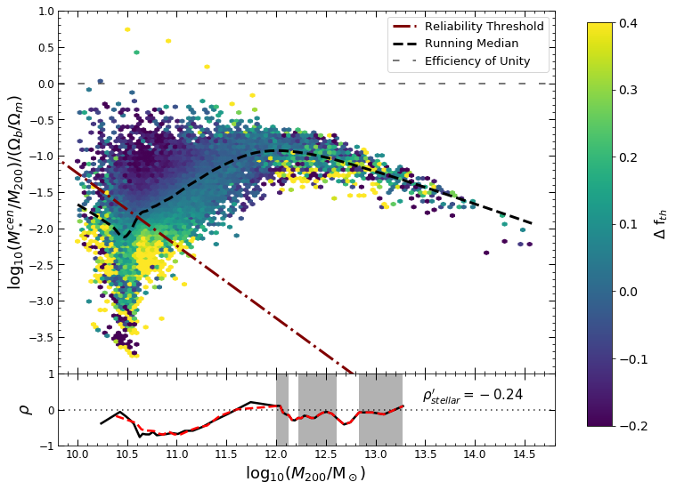

# EAGLE

## Efficiency of galaxy formation

In the cosmological context, galaxies grow via hierarchical merging from the accretion of lower mass systems.  The stellar mass - halo mass relation tells us that more massive haloes of dark matter host more massive galaxies, but this relation exhibits significant scatter i.e. other physical processes must be causing some galaxies to be less massive at some fixed value of halo mass.

Using the Evolution and Assembly of GaLaxies and their Environments (EAGLE) hydrodynamical cosmological simulations, I investigated the second order influences on the efficiency of galaxy formation by exploring what physical processes correlate with stellar mass at fixed halo mass.

Prior investigations had showed that stellar and AGN feedback directly influence formation efficiency and that morphological transformation depends on halo assembly history.  Effects of feedback can be seen in the plot below of 50 cMpc side simulation with variations in strength of feedback.

In this investigation, further physical processes in galaxies such as the birth density, metallicity, stellar age, gas density, energy fraction and gas fraction were studied to explore their correlations with formation efficiency at fixed halo mass because they trace changes in morphology and determine the mechanisms by which galaxies evolve.

## Main conclusions from the investigation

* Feedback from stars and AGN influences the ability of galaxies in exploiting high gas density to form stars.

* Low and high-mass early-assembling haloes host more efficiently formed galaxies whereas, between regimes, late-assemblers do.

* In the EAGLE simulations, the scaling relation between regimes is sensitive to the energy-fraction function and, at high halo mass, is sensitive to the modelling of AGN feedback as it is essential in reproducing observed morphological transformations.

[back](./)
