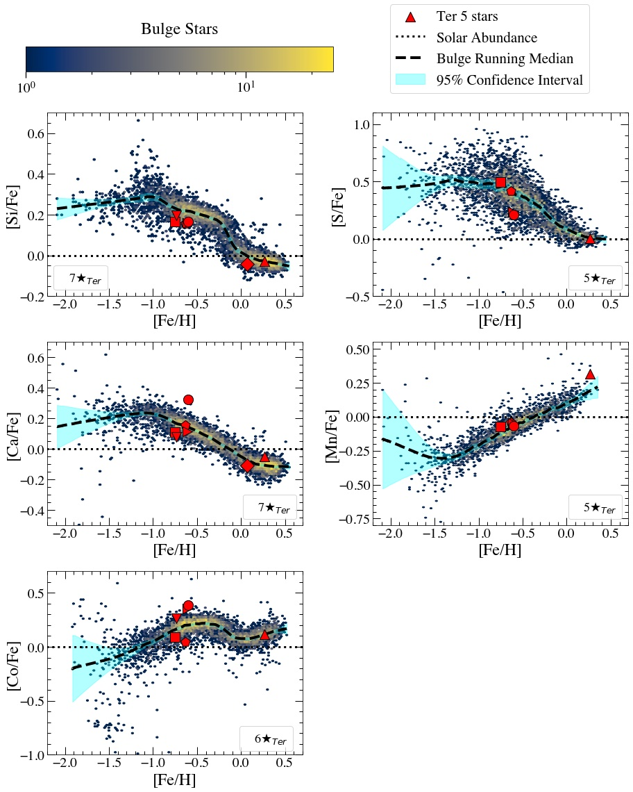
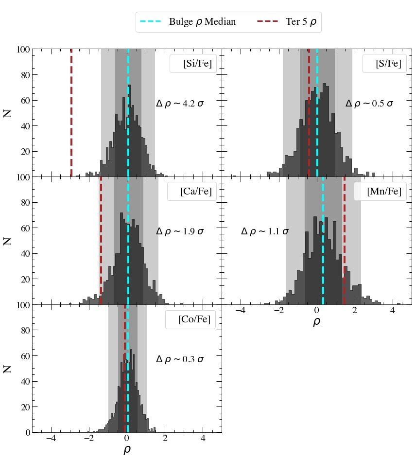
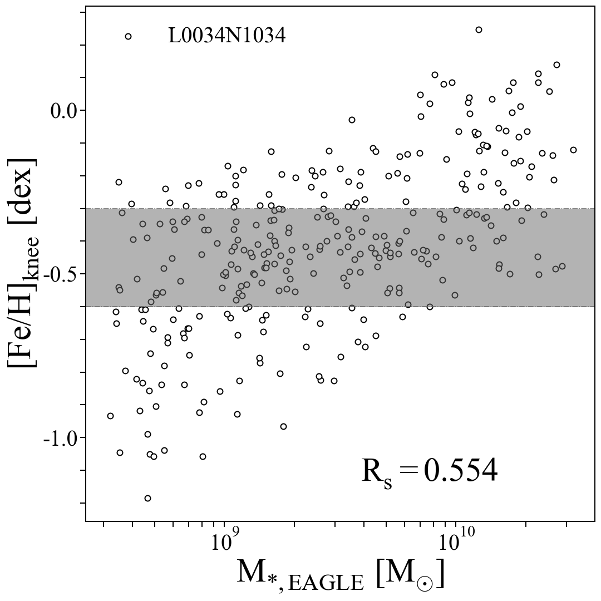

# Terzan 5

Click [here](https://arxiv.org/abs/2204.01753) for the arXiv preprint of this paper!

## What makes this system interesting?

Terzan 5 is a complex globular cluster (GC)-like system located in the bulge of the Milky Way galaxy.  It's complex due to its spread in stellar ages and metallicities but also shows characteristics of standard GCs, such as hosting multiple stellar populations.

Although one of a growing number of such systems, Terzan 5 has uniquely been shown to have a similar α-Fe plane distribution to that of the bulge.  The distribution of a system's stellar populations in this plane is a useful diagnostic of its star formation history.  Such a correlation indicates a similarity in the chemical evolution of the systems, where a decline in the [α/Fe] abundance ratio from the α-enhanced, SN II-enriched, plateau has historically been attributed to the onset of Type Ia SNe.  The similarity between Terzan 5 and the bulge in this plane has thus been suggested to be indicative of a high mass for the progenitor of Terzan 5, which would in turn suggest that this system was an important contributor to the stellar mass content of the Galactic bulge.  Therefore, it has been proposed that the cluster is the surviving remnant of a primordial building block of the Milky Way bulge.

## Comparing stellar chemistry

We tested the building block hypothesis by comparing the abundances of 10 elements in Terzan 5 stars with those of their bulge field counterparts.  The abundance distributions can be seen below for Si, S, Ca, Mn, and Co, where the bulge field is displayed as a 2D histogram, its running median as a black dashed line and 95% confidence interval as the cyan shading, and Terzan 5 stars as red shapes.

Because we acquired only a sample of 7 stars for Terzan 5 but ~ 20,000 for the bulge, we needed to compare them in a statistically robust manner; we calculated the offset of the Terzan 5 stars from the bulge field.  We also estimated values that would be expected in the case that Terzan 5 was identical to the bulge, by randomly selecting 1000 Terzan 5-sized samples from the bulge population and again calculated the offset with respect to the bulge.  Such a procedure results in a distribution of offset values for each element, which converges to a median value.  We were able to compare the offset value for Terzan 5 with the median of the offset distribution for the bulge, to evaluate how similar the two populations are.

The results can be seen below, where the offset values for the random samples are displayed as the histogram, its median value as a cyan dashed line, its 1σ and 2σ errors as dark and light shading, and the offset value for Terzan 5 as the red dashed line.  Also shown is the difference betweeen these values, Δρ.

You can see we were able to find that Terzan 5 and the bulge differ at statistically significant levels, and so we could conclude that Terzan 5 is not the remnant of a *major* building block of the bulge.

## Contribution to the Galactic bulge

We also used results from the EAGLE simulations showing the correlation between the metallicity of the α-Fe plane distribution turn-off or "knee" and stellar mass to constrain the range of masses for the progenitor of Terzan 5 and discuss the various origin scenarios.  You can see the correlation below, where the grey shading indicates the range of stellar masses for the Terzan 5 progenitor based on an estimate of its knee metallicity.

With a progenitor mass of ~ 108-109 Msol, we concluded that it couldn't be the remnant of an accreted satellite system.  We instead argue that a relatively small progenitor mass could have contributed the majority of its stellar mass to the bulge without significantly influencing the latter's mean chemistry.  In this scenario, the progenitor could have been a stellar clump which migrated from the disc to the inner Galaxy while losing most of its mass, or a rejuvenated GC due to accretion from molecular clouds.

[back](./)
